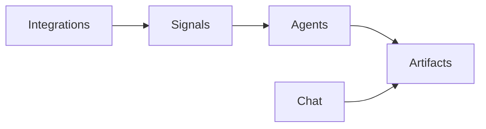

Cora has three building blocks that work together. A **signal** is something Cora detects. An **agent** is a workflow that acts on it. An **artifact** is the saved output you keep.

Use this page when you need the short definitions. Each term links to the full how-to.

## The three concepts

**Signal.** Cora detects a lifecycle event across your connected tools, such as a renewal risk, a stakeholder change, or an expansion opportunity. Signals live on the **Signals** page. A signal can start an agent. See [Setting Up Signals](/using-cora/setting-up-signals).

**Agent.** A reusable workflow with a trigger (manual, scheduled, or a signal), tasks, and an autonomy level (crawl, walk, or run). You build and refine agents in chat, then turn them on from the **Agents** page. See [Understanding Agents](/agents/understanding-agents).

**Artifact.** A saved deliverable on an account or the workspace: a document, dashboard, survey, checklist, file, or link. Agents and chat create them. You open them on the **Artifacts** page. See [Artifacts](/using-cora/artifacts).

## How they connect

1. Your [integrations](/integrations/index) feed Cora data.
2. Cora turns matching events into [signals](/using-cora/signals).
3. A signal can start an [agent](/agents/understanding-agents), or you start one yourself.
4. Chat and agents write [artifacts](/using-cora/artifacts) you can open later.

Signals detect. Agents act. Artifacts are the output.

## Not the same as

These three names get used interchangeably. They are not the same thing.

- A **signal** is an event, not a document.
- An **agent** is a workflow, not a one-off chat answer. Chat can do the same kind of work once. An agent is what you save so it can run again.
- An **artifact** is an output, not a place to store what an agent remembers from run to run. Use it for something a person should open later: a brief, a dashboard, a survey, a checklist.

## Related terms

These show up next to the three concepts. The pages below define them.

- [Skill](/agents/how-to-build-skills)
- [Task](/agents/understanding-agents)
- [Action](/getting-started/actions-and-usage)
- [Custom column](/using-cora/custom-columns)
