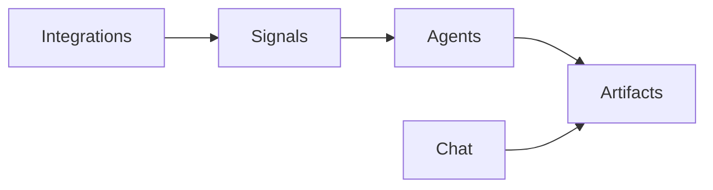

Cora has a small set of nouns that show up everywhere. Learn them here, then follow the links for the how-tos.

## Key concepts

**Signal.** Something Cora detects: a lifecycle event across your connected tools, such as a renewal risk, a stakeholder change, or an expansion opportunity. Signals live on the **Signals** page. A signal can start an agent. See [Setting Up Signals](/using-cora/setting-up-signals).

**Agent.** A reusable workflow you save so the same work can run again. An agent has a trigger (manual, scheduled, or a signal), tasks, and an autonomy level. You build and refine agents in chat, then turn them on from the **Agents** page. Trigger types and autonomy levels are covered in [Understanding Agents](/agents/understanding-agents).

**Agent run.** One execution of an agent. Each time an agent fires — on a schedule, from a signal, or when you start it — Cora creates a run. Review what happened from the **Agents** page.

**Task.** One step inside an agent. A simple agent might have a single task, such as querying data and posting to Slack. A more complex agent chains tasks: gather data, send an email, then follow up if the customer replies.

**Skill.** Reusable instructions that tell Cora what to do: the steps, the format, and the tone. An agent controls when and how often something runs. A skill is the recipe; an agent can run that skill on a schedule. See [How to Build Skills](/agents/how-to-build-skills).

**Artifact.** A saved deliverable on an account or the workspace: a document, dashboard, survey, checklist, file, or link. Agents and chat create them. You open them on the **Artifacts** page. See [Artifacts](/using-cora/artifacts).

## How they connect

1. Your [integrations](/integrations/index) feed Cora data.
2. Cora turns matching events into [signals](/using-cora/signals).
3. A signal can start an [agent](/agents/understanding-agents), or you start one yourself.
4. Chat and agents write [artifacts](/using-cora/artifacts) you can open later.

Signals detect. Agents act. Artifacts are the output.

## Not the same as

These names get used interchangeably. They are not the same thing.

- A **signal** is an event, not a document.
- An **agent** is a workflow, not a one-off chat answer. Chat can do the same kind of work once. An agent is what you save so it can run again.
- An **agent run** is one execution, not the saved output. The output you keep is an artifact.
- A **skill** is instructions, not a schedule. The schedule lives on the agent.
- An **artifact** is an output, not a place to store what an agent remembers from run to run. Use it for something a person should open later: a brief, a dashboard, a survey, a checklist.

## Related terms

These show up next to the concepts above. Each page is the how-to.

- **Action.** A unit of work Cora counts toward usage, such as sending a message or generating an artifact. See [Actions and Usage](/getting-started/actions-and-usage).
- **Custom column.** A column you add to the Accounts table to surface CRM fields, scores, or AI insights. See [Custom Columns](/using-cora/custom-columns).
